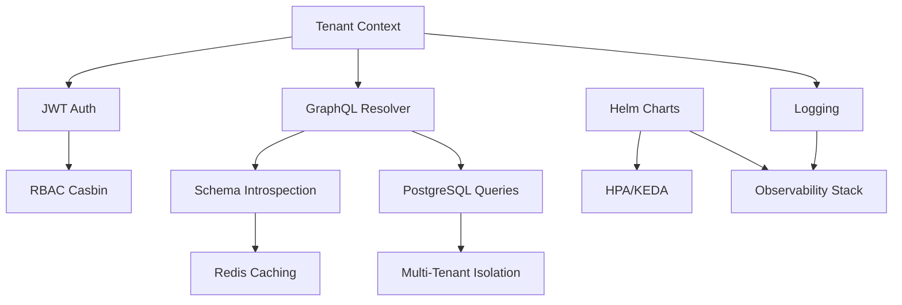

# Architecture Decision Document - Kapok

_This document builds collaboratively through step-by-step discovery. Sections
are appended as we work through each architectural decision together._

---

## Analyse du Contexte Projet

### Vue d'Ensemble des Requirements

**Requirements Fonctionnels :**

Kapok est une plateforme **Backend-as-a-Service auto-hébergée** avec
multi-tenancy native, conçue pour les développeurs frontend qui ont besoin de
contrôle sur leur infrastructure sans expertise DevOps. Les capabilities
fonctionnelles clés incluent :

**Core Features MVP (3 mois) :**

- **Multi-tenant Foundation** : Provisioning automatique de tenants avec
  isolation database-per-tenant ou schema-per-tenant
- **GraphQL Engine** : Auto-génération de schéma GraphQL à partir de
  l'introspection PostgreSQL (queries, mutations, relations)
- **CLI Developer-Friendly** : `kapok init`, `kapok dev`, `kapok deploy`,
  `kapok tenant [create|list|delete]`
- **Déploiement Kubernetes** : Helm charts auto-générés, déploiement one-command
  (EKS/GKE support), auto-scaling (HPA)
- **Developer Experience** : SDK TypeScript auto-généré, React hooks,
  zero-config par défaut

**Growth Features (4-6 mois) :**

- **Advanced Multi-Tenancy** : Option DB-per-tenant, migration automatique
  schema → DB, hierarchies parent-child
- **Real-Time** : WebSocket subscriptions GraphQL, LISTEN/NOTIFY PostgreSQL,
  latence <100ms
- **Security & Permissions** : Row-Level Security (RLS), RBAC, policy injection
  SQL, audit trail automatique
- **Advanced DX** : Visual schema builder, GraphQL Playground, performance
  profiler, `kapok time-travel`

**Vision Features (6-12 mois) :**

- **Platform Ecosystem** : Marketplace intégrations (Stripe, Twilio), CLI
  plugins, white-label
- **AI-Powered** : Suggestions architecture IA, auto-optimization queries,
  anomaly detection
- **Enterprise-Grade** : Compliance packs (GDPR/HIPAA/SOC2), penetration
  testing-as-service, multi-region active-active

**Architecture Implications :**

- Nécessite une séparation claire entre le **control plane** (gestion tenants,
  provisioning) et le **data plane** (GraphQL queries/mutations par tenant)
- Le moteur GraphQL doit être **dynamique** : génération à la volée basée sur le
  schéma de chaque tenant
- L'abstraction Kubernetes doit cacher 100% de la complexité tout en permettant
  des "escape hatches" pour les power users

---

**Requirements Non-Fonctionnels :**

**1. Compliance & Réglementaire (Critique pour Enterprise) :**

- **ISO 27001** : Security controls, risk management, audit trail, incident
  response
- **FedRAMP** : NIST 800-53 controls, monitoring continu, SSP documentation
- **SOC 2 Type II** : Audit trails complets, access control logs, change
  management
- **GDPR** : Data residency EU, right to be forgotten, data portability, consent
  management, breach notification
- **HIPAA** : Encryption AES-256 at rest/TLS 1.3+ in transit, BAA-capable, PHI
  access logging, 6-year retention
- **PCI-DSS** : Network segmentation, strong access control, vulnerability
  scanning, cardholder data encryption

**2. Sécurité (OWASP Top 10 Mitigations) :**

- **Broken Access Control** : RLS PostgreSQL, tenant context enforcement, RBAC,
  JWT rotation
- **Cryptographic Failures** : AES-256 at rest, TLS 1.3+, Vault/K8s secrets, key
  rotation
- **Injection Prevention** : Parameterized queries, GraphQL validation, no shell
  execution
- **Security Misconfiguration** : Hardened defaults, container scanning
  (Trivy/Snyk), IaC security linting
- **Authentication** : MFA support (TOTP/WebAuthn), bcrypt hashing, rate
  limiting, brute force protection
- **Logging & Monitoring** : Comprehensive security event logging, real-time
  alerting, 1-year retention minimum

**3. Performance & Scalabilité :**

- **Query Performance** : GraphQL simple queries p95 <100ms, complex queries p95
  <500ms
- **Real-Time** : WebSocket connection <50ms, subscription latency <100ms, 1000+
  concurrent connections
- **Redis Caching** : Query result caching (80%+ hit rate), session caching,
  schema metadata caching, rate limiting distribué
- **Connection Pooling** : PgBouncer/Pgpool-II, dynamic pool sizing (10-100 per
  tenant)
- **Auto-Scaling** : HPA (CPU >70%, memory >80%), VPA recommendations, custom
  metrics (query latency)

**4. Disaster Recovery & Business Continuity :**

- **RPO/RTO par Tier** :
  - Standard : RPO 6h, RTO 4h (snapshots 6-hourly)
  - Professional : RPO 1h, RTO 1h (incremental hourly, hot standby)
  - Enterprise : RPO <5min, RTO <15min (synchronous replication, auto-failover)
- **Multi-Region** : Active-passive (Standard/Pro), active-active (Enterprise),
  data residency enforcement
- **Backups** : Full daily (30 days retention), incremental hourly (7 days),
  PITR, AES-256 encrypted, immutable (WORM)

**5. Intégrations & Observabilité :**

- **Cloud Providers** : AWS (EKS/RDS/S3), GCP (GKE/Cloud SQL), Azure
  (AKS/Postgres), bare-metal (k3s/k0s)
- **Monitoring** : Prometheus (default), Datadog, New Relic, Grafana Cloud
- **Logging** : Loki, ELK Stack, Splunk
- **Tracing** : OpenTelemetry, Jaeger, Zipkin
- **Secrets** : Vault (first-class), AWS Secrets Manager, GCP Secret Manager,
  Azure Key Vault

**Architecture Implications :**

- Architecture **modulaire** avec compliance comme add-ons activables (pas
  monolithique)
- Layer de **caching Redis** critique pour performance (queries, sessions, rate
  limiting)
- **Multi-region deployment strategy** doit être baked-in dès le début (pas un
  afterthought)
- **Observability stack** doit être auto-configuré (Prometheus/Grafana déployés
  automatiquement)

---

### Scale & Complexité

**Évaluation de Complexité du Projet :**

**Niveau de Complexité : TRÈS ÉLEVÉ (Enterprise-Grade Infrastructure Platform)**

**Indicateurs de Complexité :**

1. **Multi-Tenancy Native** :
   - 3 modèles d'isolation (schema/DB/dedicated instance)
   - Migration automatique inter-modèles
   - Tenant router dynamique
   - Resource quotas et blast radius containment

2. **Abstraction Kubernetes Complète** :
   - Génération Helm charts multi-cloud
   - Auto-scaling (HPA + VPA + custom metrics)
   - Zero-downtime upgrades (blue-green, canary)
   - NetworkPolicies, PodSecurityPolicies auto-configurés

3. **GraphQL Engine Dynamique** :
   - Introspection PostgreSQL → GraphQL schema
   - Relations auto-détectées (foreign keys)
   - N+1 prevention (Dataloader pattern)
   - Query complexity analysis
   - Type generation (TypeScript, GraphQL, React hooks)

4. **Compliance Multi-Certification** :
   - 6 certifications simultanées (ISO/FedRAMP/SOC2/GDPR/HIPAA/PCI-DSS)
   - Compliance-as-modules architecture
   - Audit trail immutable
   - Policy templates pré-construits

5. **Real-Time Distribué** :
   - WebSocket subscriptions cross-tenant
   - PostgreSQL LISTEN/NOTIFY integration
   - Message throughput 10K msg/sec
   - Latence <100ms end-to-end

6. **Disaster Recovery Enterprise** :
   - Multi-region avec RPO <5min, RTO <15min
   - Automated failover
   - Point-in-time recovery à la seconde
   - Immutable backups (ransomware protection)

**Domaine Principal : Developer Platform / Infrastructure-as-Code**

- **Type** : CLI-driven tooling + Backend-as-a-Service
- **Paradigme** : Convention over configuration, zero-config defaults, escape
  hatches pour experts
- **Audience** : Frontend developers (React/Vue/Next.js) sans expertise DevOps

**Composants Architecturaux Estimés : 12-15 services majeurs**

1. **Control Plane** : Tenant management, provisioning orchestrator
2. **GraphQL Engine** : Query/mutation processor, schema generator
3. **Database Provisioner** : PostgreSQL instance/schema creator
4. **Tenant Router** : Request routing par tenant context
5. **Auth Service** : JWT, MFA, RBAC enforcement
6. **Real-Time Service** : WebSocket manager, subscription handler
7. **Migration Service** : Schema evolution, tenant tier migration
8. **Backup/Recovery** : PITR, snapshot orchestrator
9. **Monitoring/Observability** : Metrics collector, alerting
10. **CLI Backend** : API server pour `kapok` commands
11. **Compliance Module Manager** : Policy enforcement, audit logging
12. **Cache Layer** : Redis cluster pour queries/sessions/rate limiting

---

### Contraintes Techniques & Dépendances

**Contraintes Identifiées :**

1. **Kubernetes Version Compatibility** :
   - Minimum : Kubernetes 1.24+
   - Support multi-cloud : EKS, GKE, AKS avec optimizations cloud-specific
   - Bare-metal : k3s, k0s, vanilla Kubernetes

2. **PostgreSQL Versions** :
   - Support : PostgreSQL 13, 14, 15, 16
   - Features requises : Logical replication (multi-region), LISTEN/NOTIFY
     (real-time), Row-Level Security

3. **Language & Runtime** :
   - **Backend (GraphQL Engine, Control Plane)** : Go (performance, single
     binary)
   - **CLI** : Go (cross-platform, easy distribution)
   - **SDK/Types** : TypeScript (frontend integration)

4. **Dépendances Critiques** :
   - **Helm** : Chart generation et deployment
   - **Redis** : Caching, rate limiting, session storage
   - **PgBouncer/Pgpool-II** : Connection pooling
   - **Prometheus/Grafana** : Observability stack
   - **HashiCorp Vault** (optionnel) : Secrets management enterprise

5. **Cloud Provider APIs** :
   - AWS : EKS API, RDS API, S3 API, Secrets Manager
   - GCP : GKE API, Cloud SQL API, Cloud Storage, Secret Manager
   - Azure : AKS API, PostgreSQL API, Blob Storage, Key Vault

**Trade-offs Architecturaux à Décider :**

- **GraphQL Engine : Build vs Fork Hasura** :
  - Build custom (Go) = full control, innovation possible, mais time-intensive
  - Fork Hasura = faster to market, mature codebase, mais Haskell→Go rewrite
    complexe
  - **PRD indique** : "Hasura-inspired Go engine" (custom build avec patterns
    Hasura)

- **Multi-Tenant Isolation : Schema vs DB Default** :
  - MVP PRD indique : **Schema-per-tenant** (plus simple, moins de ressources)
  - Growth features : DB-per-tenant option avec auto-migration

- **Secrets Management : Built-in vs External** :
  - Built-in (K8s Secrets) = simple, mais moins sécurisé
  - External (Vault) = enterprise-grade, mais dépendance additionnelle
  - **Décision** : K8s Secrets par défaut, Vault en option enterprise

---

### Préoccupations Transversales Identifiées

**1. Developer Experience (DX) Consistency**

- Zero-config par défaut doit fonctionner pour 90% des use cases
- Error messages doivent être actionables, pas des stack traces cryptiques
  Kubernetes
- CLI doit avoir response time <500ms pour commandes locales
- Type generation (TypeScript) doit rester synchronisée automatiquement avec DB
  schema

**2. Multi-Tenant Isolation & Security**

- **Tenant context** doit être propagé à chaque layer (API → GraphQL → Database)
- RLS PostgreSQL comme defense-in-depth (backup même si tenant router échoue)
- Resource quotas Kubernetes par tenant (CPU, memory, storage limits)
- Network isolation (NetworkPolicies) pour prévenir cross-tenant traffic

**3. Observability & Debugging**

- Logs doivent inclure `tenant_id` dans chaque entrée (correlation)
- Metrics par tenant (CPU, memory, query latency, error rate)
- Distributed tracing pour requests multi-services
- Health checks à tous les niveaux (pod/service/tenant)

**4. Compliance & Audit Trail**

- Tous les événements critiques logged : auth attempts, data access,
  modifications, deletions
- Logs **immutables** (append-only, cryptographically signed pour SOC2/HIPAA)
- Retention policies configurables (1 year default, 6 years pour HIPAA PHI)
- Data residency enforcement (EU data jamais sur US servers)

**5. Performance & Scalabilité Cross-Cutting**

- Connection pooling doit être tenant-aware (éviter "noisy neighbor")
- Redis caching doit gérer cache invalidation cross-tenant
- Auto-scaling doit détecter per-tenant load spikes
- Query performance monitoring avec slow query detection automatique

**6. Operational Excellence**

- Zero-downtime deployments (blue-green, canary releases)
- Automated rollback sur health check failures
- Database migrations réversibles (forward ET backward compatible)
- Feature flags pour désactivation instantanée de nouvelles features

---

## Foundation Technique & Structure Projet

### Domaine Technologique Principal

**Infrastructure Platform / CLI Tooling** - Backend-as-a-Service auto-hébergé
avec CLI Go et services microservices sur Kubernetes

### Choix Technologiques de Base

**1. Structure Projet : Monorepo Go**

**Rationale :**

- **Coordination simplifiée** : CLI, Control Plane, GraphQL Engine, et services
  partagent le même repository
- **go.mod partagé** : Gestion centralisée des dépendances
- **Code sharing** : Packages communs (auth, logging, tenant-context) facilement
  partagés
- **Atomic commits** : Changements cross-services dans un seul PR
- **CI/CD simplifié** : Un seul pipeline build tous les services

**Structure Monorepo Recommandée :**

```
kapok/
├── cmd/
│   ├── kapok/              # CLI binary entry point
│   ├── control-plane/      # Control plane service
│   ├── graphql-engine/     # GraphQL engine service
│   └── provisioner/        # Database provisioner service
├── internal/
│   ├── auth/              # Auth & RBAC logic (NOT common/utils)
│   ├── tenant/            # Multi-tenant context propagation
│   ├── database/          # DB connection & pooling
│   ├── graphql/           # GraphQL resolver business logic
│   └── k8s/               # Kubernetes client abstractions
├── pkg/
│   ├── api/               # Shared API types (exported, RARE)
│   └── config/            # Configuration structs
├── deployments/
│   └── helm/              # Helm charts per service
├── testdata/              # Test fixtures, PostgreSQL schemas
├── scripts/               # Build & deployment scripts
└── go.mod                 # Single dependency file
```

**Architectural Guidelines (from Dev perspective) :**

- ❌ **Éviter** : `internal/common/utils/` → death by utils
- ✅ **Préférer** : Chaque helper a un domain home (`internal/auth/token.go` pas
  `utils/token.go`)
- ✅ **Exported packages (`pkg/`)** : RARE - seulement ce qui sera
  potentiellement extracted en library séparée

**Trade-offs Acceptés :**

- ✅ **Pro** : Facilite refactoring cross-services, DX améliorée, test fixtures
  partagés
- ⚠️ **Con** : Repository plus large, build time potentiellement plus long
  (mitigé par CI caching), blast radius sur breaking changes

**Scaling Consideration :** Si monorepo dépasse 50K LOC, investir dans Bazel ou
similaire pour build caching distribué

---

**2. CLI Framework : Cobra**

**Version :** `github.com/spf13/cobra` (latest stable - standard industrie :
kubectl, helm, hugo, gh)

**Rationale :**

- **Production-proven** : Utilisé par les plus grands projets CLI Go (kubectl,
  helm, hugo)
- **Rich features** : Sous-commandes, flags persistants, auto-completion
  (bash/zsh/fish), validation
- **Excellent DX** : Génération automatique de documentation, help text bien
  formaté
- **Mature & maintenu** : 10+ ans d'histoire, community active

**Command Structure :**

```bash
kapok init           # Initialize project
kapok dev            # Local dev environment
kapok deploy         # Deploy to K8s
kapok tenant create  # Create tenant
kapok tenant list    # List tenants
kapok tenant delete  # Delete tenant
kapok migrate        # Run migrations
kapok status         # Platform health
kapok logs <tenant>  # Stream logs
```

**Implementation Pattern (Testability-first) :**

```go
// cmd/kapok/cmd/root.go
func Execute(out io.Writer, args []string) error {
    // Inject io.Writer for testability
    cmd.SetOut(out)
    cmd.SetArgs(args)
    return cmd.Execute()
}

// Tests pass bytes.Buffer, assert output
```

**Architectural Decisions Made :**

- Commandes organisées en groupes logiques (`tenant.*`, `config.*`)
- Flags persistants : `--context`, `--namespace`, `--output=json`
- Validation automatique des arguments
- Auto-completion shell pour améliorer UX
- Mock filesystem pour tester `kapok init`

---

**3. GraphQL Framework : gqlgen**

**Version :** `github.com/99designs/gqlgen` (latest stable)

**Rationale :**

- **Code-first & Type-safe** : Génère code Go depuis schema GraphQL, zero
  reflection runtime
- **Performance** : Benchmarks >10K req/sec, parmi les plus rapides libs GraphQL
  Go
- **Dataloader built-in** : Résout N+1 queries automatiquement
- **Extensible** : Custom directives pour RLS, tenant-context injection, caching
- **Production-proven** : Khan Academy, Vimeo, et autres à scale

**Integration avec Kapok :**

```go
// Dynamic schema generation per tenant
type Resolver struct {
    tenantID string
    db       *sql.DB
    loader   *dataloader.Loader
}

// Auto-generate queries from PostgreSQL introspection
// Relations detected via foreign keys
```

**Architectural Decisions Made :**

- **Schema-first workflow** : GraphQL schema généré depuis PostgreSQL
  introspection
- **Resolver pattern** : Séparation business logic / GraphQL layer
- **Context propagation** : `tenant_id` + `request_id` propagés via
  `context.Context`
- **N+1 prevention** : Dataloader pattern automatique pour relations

> [!WARNING]
> **Query Complexity Analysis MANDATORY** : Sans ça, un seul tenant peut DDOS
> l'engine avec :
>
> ```graphql
> users { posts { comments { likes { user { posts { ... 10 levels } } } } } }
> ```
>
> Implémenter dès MVP :
>
> ```go
> complexity := graphql.ComplexityLimit(1000)  // Max query cost
> ```

**Maintainability Strategy (Dev insights) :**

- Auto-generated resolvers = 80% de la codebase
- **DECISION** : Commit generated code (visible CI fails si désynchronisé) vs
  `.gitignore` (clean repo mais surprise failures)
- **Recommandation** : Commit generated files, annoter clairement dans README

---

**4. Configuration Management : Viper**

**Version :** `github.com/spf13/viper` (latest stable - standard : kubectl,
hugo)

**Rationale :**

- **Multi-source config** : YAML, JSON, ENV vars, CLI flags avec precedence
  order
- **Hot-reload** : Watch config files, reload sans restart
- **Remote config** : Support Consul, etcd pour config distribuée (future)
- **Type-safe** : Unmarshalling vers structs Go
- **Standard de facto** : Majority projets Go enterprise

**Config Hierarchy (Precedence) :**

```
1. CLI flags (highest priority)
2. Environment variables  
3. kapok.yaml (project config)
4. ~/.kapok/config.yaml (global config)
5. Defaults (lowest priority)
```

**Example Config Structure :**

```yaml
# kapok.yaml
project: my-backend
database:
  type: postgres
  version: "15"
  isolation: schema-per-tenant
kubernetes:
  cluster: production
  namespace: kapok
observability:
  prometheus: true
  grafana: true
```

**Implementation Best Practice (Testability) :**

```go
// ❌ ÉVITER : Viper global partout = untestable
host := viper.GetString("db.host")

// ✅ PRÉFÉRER : Unmarshal early, pass structs
type Config struct {
    DB DatabaseConfig
    K8s KubernetesConfig
}
var cfg Config
viper.Unmarshal(&cfg)
// Pass cfg, not viper instance
```

**Architectural Decisions Made :**

- Config validation au startup (fail-fast)
- Secrets JAMAIS dans config files (ENV vars ou Vault integration)
- Convention over configuration (defaults intelligents pour 90% use cases)
- **Documentation explicite** de precedence rules (avoid production surprises)

**Test Requirements :**

```go
TestConfigPrecedence()  // CLI flag > ENV > YAML
TestConfigDefaults()    // Missing keys → sane defaults
TestConfigValidation()  // Invalid config → clear error messages
```

---

**5. Logging & Observability : zerolog**

**Version :** `github.com/rs/zerolog` (latest stable)

**Rationale :**

- **Performance** : Plus rapide que zap/logrus (zero allocation logging)
- **JSON-first** : Structured logging optimal pour Prometheus/Loki/ELK
- **Context-aware** : Logging avec `tenant_id`, `request_id` automatique
- **Minimal overhead** : Critical pour performance GraphQL queries (<100ms
  target)
- **Production-proven** : Cloudflare, Segment à très high scale

**Log Structure Standard :**

```json
{
  "level": "info",
  "tenant_id": "tenant_123",
  "request_id": "req_abc",
  "query": "users",
  "latency_ms": 45,
  "timestamp": "2026-01-23T15:38:00Z",
  "message": "GraphQL query executed"
}
```

**Dev DX Consideration :**

```go
// Production : JSON optimized for Loki
log := zerolog.New(os.Stdout)

// Development : Pretty console for readability
if env == "development" {
    log = zerolog.New(zerolog.ConsoleWriter{Out: os.Stdout})
}

// Tests : Discard or capture for assertions
log := zerolog.New(io.Discard)  // Silent tests
// OR capture pour test oracle
buf := &bytes.Buffer{}
log := zerolog.New(buf)
assert.Contains(buf.String(), `"level":"error"`)
```

**Integration avec Observability Stack :**

- **Loki** : Logs centralisés avec labels (`tenant_id`, `service`, `level`)
- **Grafana** : Dashboards query latency per tenant
- **Prometheus** : Metrics exportées depuis logs (error rate, latency
  percentiles)

**Architectural Decisions Made :**

- **Structured logging only** : Pas de unstructured text logs
- **Correlation IDs** : `request_id` propagé à travers tous les services
- **Log levels** : DEBUG (dev), INFO (prod), ERROR (always)
- **Sampling** : High-volume tenant logs samplés pour éviter overwhelm
  (configurable par tenant)
- **Logger injection** : Jamais de logger global, toujours injecté (testability)

**Test Oracle Pattern :**

```go
// Assert critical paths via logs
assert.Contains(logOutput, `"tenant_id":"tenant_123"`)
assert.Contains(logOutput, `"latency_ms":45`)
```

---

### Dépendances Additionnelles Critiques

**PostgreSQL Driver :**

- **pgx** (recommandé) : Performance supérieure, features PostgreSQL-specific
  (LISTEN/NOTIFY, COPY)
- Alternative : `lib/pq` (plus ancien, moins performant)

**Redis Client :**

- **go-redis/redis** : Client standard, connection pooling, cluster support,
  pub/sub

**Kubernetes Client :**

- **client-go** : Official K8s client, génération Helm charts
- **helm/v3** : Helm SDK pour programmatic chart generation

**Error Handling :**

- **Stdlib `%w` wrapping** : Go 1.13+ error wrapping
- **Considérer** : `github.com/pkg/errors` pour stack traces in logs (debugging
  production sans stack = guessing game)

**Testing :**

- **testify** : Assertions (`assert`, `require`) et mocks
- **dockertest** : Integration tests avec PostgreSQL/Redis containers éphémères

**Build & Distribution :**

- **GoReleaser** : Cross-platform binary builds (Linux/macOS/Windows),
  Homebrew/apt packages auto
- **Docker multi-stage builds** : Minimal container images (<50MB avec
  distroless base)

---

### Observability Cross-Service (CRITIQUE)

> [!IMPORTANT]
> **OpenTelemetry dès le MVP** : Avec monorepo déployant plusieurs binaries
> (CLI, control-plane, graphql-engine), context propagation est CRITIQUE.
>
> **Requirements :**
>
> - `request_id` + `tenant_id` propagés via OpenTelemetry context
> - Distributed tracing pour requests traversant plusieurs services
> - Metrics exportées (query latency, error rates, tenant resource usage)
>
> **Sans ça** : Debugging production multi-service = impossible.

**Stack OpenTelemetry :**

```go
import "go.opentelemetry.io/otel"

// Propagate context across service boundaries
ctx = otel.GetTextMapPropagator().Extract(ctx, carrier)
span := tracer.Start(ctx, "graphql.query")
defer span.End()
```

---

### Test Architecture Strategy

**Coverage Cibles par Domain (pas generic 80%) :**

| Package             | Target Coverage | Rationale                                 |
| ------------------- | --------------- | ----------------------------------------- |
| `internal/graphql/` | 90%+            | Critical path - query execution           |
| `internal/tenant/`  | 85%+            | Multi-tenant isolation core               |
| `internal/auth/`    | 85%+            | Security-critical                         |
| `cmd/kapok/`        | 60%+            | CLI hard to test, focus on business logic |

**Test Layers :**

> [!WARNING]
> **PostgreSQL Introspection → GraphQL (Innovation Core)** :\
> Ceci est votre différenciateur technique PRIMARY. Integration tests MANDATORY
> avec real schemas variés :
>
> - Simple tables (users, posts)
> - Foreign keys multi-niveaux (relations imbriquées)
> - PostgreSQL types : enums, arrays, JSON/JSONB, geography
> - Edge cases : self-referential FK, circular relations
>
> **Fixtures** : `testdata/schemas/` avec migrations SQL, assert generated
> GraphQL matches expectations

**CI Strategy :**

```yaml
# Éviter explosion combinatoire
- Go: 1.22 (latest), 1.21 (oldest supported)
- PostgreSQL: 16 (latest), 13 (oldest supported)
- Redis: 7 (latest), 6 (oldest supported)
# Total: 8 matrix jobs, pas 24
```

**Test Speed Targets :**

- Unit tests : <10s total (parallel par package)
- Integration tests : <2min (sequential, dockertest containers)
- E2E smoke tests : <5min (minimal, critical paths only)

---

### Initialisation du Projet

Le projet sera initialisé manuellement avec cette structure. **Premiers
implementation stories :**

1. **Setup monorepo structure** : Créer arborescence `cmd/`, `internal/`, `pkg/`
2. **Initialize go.mod** : Core dependencies (Cobra, Viper, zerolog, pgx,
   go-redis)
3. **Scaffold CLI avec Cobra** : Commandes principales (`init`, `deploy`,
   `tenant`)
4. **Setup config avec Viper** : Hierarchy (flags > ENV > YAML > defaults)
5. **Setup logging avec zerolog** : JSON production, pretty dev, injectable pour
   tests
6. **OpenTelemetry integration** : Context propagation, distributed tracing
   boilerplate

**Pas de "create-kapok" generator** - setup manuel documenté dans
`docs/setup.md`

---

## Core Architectural Decisions

### Decision Priority Analysis

**Critical Decisions (Block Implementation) :**

1. **Multi-Tenant Isolation Strategy** : Schema-per-tenant (MVP) → DB-per-tenant
   (Growth)
2. **GraphQL Schema Generation** : Runtime introspection + Redis caching
3. **Tenant Context Propagation** : Go context.Context standard
4. **Authentication** : JWT avec tenant_id claims
5. **Infrastructure Deployment** : Helm charts avec auto-scaling
6. **Observability** : Auto-deployed Prometheus/Grafana/Loki/Jaeger stack

**Important Decisions (Shape Architecture) :**

1. **RBAC Implementation** : Casbin pour hiérarchies complexes
2. **Auto-Scaling Strategy** : HPA + KEDA pour metrics custom per-tenant
3. **Real-Time Architecture** : PostgreSQL LISTEN/NOTIFY + Redis Pub/Sub
   (Growth)
4. **Redis Strategy** : Sentinel (MVP) → Cluster (Growth)
5. **Alerting Tiers** : Critical (PagerDuty) / Warning (Slack) / Info (Metrics)

**Deferred Decisions (Post-MVP) :**

1. **DB-per-tenant migration** : Défini mais implémenté en Growth phase
2. **WebSocket subscriptions** : Architecture planifiée, implémenté post-MVP
3. **Advanced compliance modules** : ISO/FedRAMP/HIPAA (post-MVP avec business
   validation)
4. **AI-powered suggestions** : Vision phase (6-12 mois)

---

### Multi-Tenant Data Architecture

**Decision : Schema-per-tenant (MVP) with Auto-Migration Path**

**Implementation MVP :**

```go
// Single PostgreSQL cluster
// Tenant schemas: public.tenant_<id>_<table>

type TenantIsolation struct {
    Strategy    string // "schema-per-tenant"
    SchemaName  string // "public.tenant_123"
    Database    string // "kapok_main"
}

// Row-Level Security comme defense-in-depth
CREATE POLICY tenant_isolation ON users
    USING (tenant_id = current_setting('app.tenant_id')::uuid);
```

**Growth Migration Strategy :**

```go
// Trigger: Usage thresholds
type MigrationTrigger struct {
    StorageGB       float64 // > 50GB
    ConnectionCount int     // > 100 concurrent
    QueriesPerSec   int     // > 1000 qps
}

// Zero-downtime migration
func MigrateToDedicatedDB(tenantID string) error {
    // 1. Provision new PostgreSQL instance
    newDB := provisioner.CreateDB(tenantID)
    
    // 2. Setup logical replication
    replication.Start(sourceSchema, newDB)
    
    // 3. Sync until lag < 1s
    replication.WaitForSync()
    
    // 4. Switch routing atomically
    router.UpdateRoute(tenantID, newDB)
    
    return nil
}
```

**Resource Quotas (Kubernetes) :**

```yaml
# Per-tenant resource limits
quotas:
  cpu: "2000m" # 2 CPU cores
  memory: "4Gi" # 4GB RAM
  storage: "100Gi" # 100GB persistent storage
  connections: 100 # Max DB connections
```

**Rationale :**

- 🎯 MVP speed : Schema-per-tenant plus simple, moins de ressources
- 🔒 Security : RLS comme backup layer (defense-in-depth)
- 📊 Scaling path : Auto-migration vers DB-per-tenant quand nécessaire
- 💰 Cost-efficient : Shared resources pour petits tenants

---

**Decision : Runtime GraphQL Schema Introspection + Redis Caching**

**Implementation :**

```go
// GraphQL schema generation
func (e *Engine) GetSchema(ctx context.Context, tenantID string) (*graphql.Schema, error) {
    // 1. Check Redis cache
    cached, exists := redis.Get(ctx, "schema:"+tenantID)
    if exists {
        return cached, nil
    }
    
    // 2. Introspect PostgreSQL
    tables, err := db.IntrospectSchema(ctx, tenantID)
    if err != nil {
        return nil, err
    }
    
    // 3. Generate GraphQL schema
    schema := gqlgen.GenerateFromTables(tables)
    
    // 4. Cache for 5 minutes (balance freshness vs performance)
    redis.Set(ctx, "schema:"+tenantID, schema, 5*time.Minute)
    
    return schema, nil
}
```

**Cache Invalidation :**

```go
// DDL operations invalidate cache
func (db *Database) ExecuteDDL(ctx context.Context, sql string) error {
    tenantID := ctx.Value("tenant_id").(string)
    
    // Execute migration
    err := db.Exec(ctx, sql)
    if err != nil {
        return err
    }
    
    // Invalidate schema cache
    redis.Del(ctx, "schema:"+tenantID)
    
    return nil
}
```

**PostgreSQL Introspection Query :**

```sql
-- Extract table structure
SELECT 
    c.table_name,
    c.column_name,
    c.data_type,
    c.is_nullable,
    tc.constraint_type,
    kcu.referenced_table_name,
    kcu.referenced_column_name
FROM information_schema.columns c
LEFT JOIN information_schema.key_column_usage kcu
    ON c.table_name = kcu.table_name 
    AND c.column_name = kcu.column_name
LEFT JOIN information_schema.table_constraints tc
    ON kcu.constraint_name = tc.constraint_name
WHERE c.table_schema = $1  -- tenant schema
ORDER BY c.table_name, c.ordinal_position;
```

**Rationale :**

- ⚡ Performance : Redis caching élimine overhead introspection (cache hit 80%+)
- 🔄 Freshness : 5-min TTL balance performance vs schema changes visibility
- 🎯 Simplicity : DDL changes automatically reflected après cache expiry
- 🧪 Complexity Analysis : Intégré dans gqlgen (limite max depth, cost)

---

**Decision : context.Context pour Tenant Propagation**

**Implementation Pattern :**

```go
// HTTP Middleware injecte tenant_id
func TenantMiddleware(next http.Handler) http.Handler {
    return http.HandlerFunc(func(w http.ResponseWriter, r *http.Request) {
        // Extract tenant_id from JWT
        token := extractJWT(r)
        tenantID := token.Claims["tenant_id"]
        
        // Inject into context
        ctx := context.WithValue(r.Context(), "tenant_id", tenantID)
        
        // Propagate
        next.ServeHTTP(w, r.WithContext(ctx))
    })
}

// Database queries use context
func (r *Resolver) GetUsers(ctx context.Context) ([]*User, error) {
    tenantID := ctx.Value("tenant_id").(string)
    
    // Set PostgreSQL session variable
    db.Exec(ctx, "SET app.tenant_id = $1", tenantID)
    
    // Query with RLS enforcement
    return db.Query(ctx, "SELECT * FROM users")
}

// Logging extracts tenant_id from context
func LogQuery(ctx context.Context, query string) {
    tenantID := ctx.Value("tenant_id").(string)
    log.Info().
        Str("tenant_id", tenantID).
        Str("query", query).
        Msg("GraphQL query executed")
}
```

**OpenTelemetry Integration :**

```go
// Distributed tracing propagates tenant_id
span := trace.SpanFromContext(ctx)
span.SetAttributes(
    attribute.String("tenant.id", tenantID),
    attribute.String("request.id", requestID),
)
```

**Rationale :**

- 🔒 Security : Tenant context propagé automatiquement, impossible à oublier
- 🎯 Type-safe : Compile-time checks via context keys
- 📊 Observability : Tenant_id dans tous les logs/traces/metrics
- ⚡ Performance : Zero overhead (context = map lookup)

---

### Authentication & Authorization

**Decision : JWT avec tenant_id Claims**

**JWT Structure :**

```json
{
  "sub": "user_abc123",
  "tenant_id": "tenant_xyz789",
  "email": "user@example.com",
  "roles": ["admin", "developer"],
  "permissions": ["graphql:query", "graphql:mutate", "tenant:manage"],
  "iat": 1706025600,
  "exp": 1706111600
}
```

**Token Generation :**

```go
func GenerateToken(user *User, tenant *Tenant) (string, error) {
    claims := jwt.MapClaims{
        "sub":       user.ID,
        "tenant_id": tenant.ID,
        "email":     user.Email,
        "roles":     user.Roles,
        "permissions": rbac.GetPermissions(user, tenant),
        "iat":       time.Now().Unix(),
        "exp":       time.Now().Add(24 * time.Hour).Unix(),
    }
    
    token := jwt.NewWithClaims(jwt.SigningMethodHS256, claims)
    return token.SignedString(secretKey)
}
```

**Middleware Validation :**

```go
func AuthMiddleware(next http.Handler) http.Handler {
    return http.HandlerFunc(func(w http.ResponseWriter, r *http.Request) {
        // Extract token
        tokenString := r.Header.Get("Authorization")
        
        // Validate JWT
        token, err := jwt.Parse(tokenString, keyFunc)
        if err != nil {
            http.Error(w, "Unauthorized", 401)
            return
        }
        
        // Inject claims into context
        ctx := context.WithValue(r.Context(), "jwt_claims", token.Claims)
        next.ServeHTTP(w, r.WithContext(ctx))
    })
}
```

**Rationale :**

- 🔒 Stateless : No session storage required
- 🎯 Multi-tenant native : tenant_id embedded in token
- ⚡ Performance : No DB lookup per request
- 🔄 Rotation : Short-lived tokens (24h) avec refresh token pattern

---

**Decision : Casbin pour RBAC Hiérarchique**

**Library :** `github.com/casbin/casbin` v2 + PostgreSQL adapter

**RBAC Model (Casbin DSL) :**

```ini
[request_definition]
r = sub, obj, act, tenant

[policy_definition]
p = sub, obj, act, tenant

[role_definition]
g = _, _
g2 = _, _  # resource hierarchy

[policy_effect]
e = some(where (p.eft == allow))

[matchers]
m = g(r.sub, p.sub) && r.obj == p.obj && r.act == p.act && r.tenant == p.tenant
```

**Policies (PostgreSQL) :**

```sql
CREATE TABLE casbin_rule (
    ptype VARCHAR(10),
    v0 VARCHAR(256),  -- subject (user/role)
    v1 VARCHAR(256),  -- object (resource)
    v2 VARCHAR(256),  -- action (read/write/delete)
    v3 VARCHAR(256),  -- tenant_id
    v4 VARCHAR(256),  -- optional
    v5 VARCHAR(256)   -- optional
);

-- Example policies
INSERT INTO casbin_rule VALUES
    ('p', 'admin', 'users', 'write', 'tenant_123'),
    ('p', 'developer', 'users', 'read', 'tenant_123'),
    ('g', 'user_abc', 'admin', '', 'tenant_123');  -- role assignment
```

**Enforcement :**

```go
func (r *Resolver) CreateUser(ctx context.Context, input CreateUserInput) (*User, error) {
    tenantID := ctx.Value("tenant_id").(string)
    userID := ctx.Value("jwt_claims").(jwt.MapClaims)["sub"].(string)
    
    // Check permission
    allowed, err := enforcer.Enforce(userID, "users", "write", tenantID)
    if !allowed {
        return nil, errors.New("permission denied")
    }
    
    // Execute mutation
    return db.CreateUser(ctx, input)
}
```

**Rationale :**

- 🎯 Proven : Casbin utilisé par Kubernetes, Docker, etc.
- 🔧 Flexible : Supporte hiérarchies Organization → Project → Team
- 📊 Scalable : PostgreSQL adapter = query-efficient
- 🔒 Audit : Toutes permissions logged automatiquement

---

### Infrastructure & Deployment

**Decision : Helm Charts per-Service + Umbrella Chart**

**Structure :**

```
deployments/helm/
├── control-plane/
│   ├── Chart.yaml
│   ├── values.yaml
│   └── templates/
│       ├── deployment.yaml
│       ├── service.yaml
│       └── hpa.yaml
├── graphql-engine/
│   └── ...
├── provisioner/
│   └── ...
└── kapok-platform/          # Umbrella chart
    ├── Chart.yaml
    ├── values.yaml           # Global values
    └── requirements.yaml     # Dependencies
```

**Umbrella Chart (kapok-platform/Chart.yaml) :**

```yaml
apiVersion: v2
name: kapok-platform
version: 0.1.0
dependencies:
  - name: control-plane
    version: 0.1.0
    repository: "file://../control-plane"
  - name: graphql-engine
    version: 0.1.0
    repository: "file://../graphql-engine"
  - name: provisioner
    version: 0.1.0
    repository: "file://../provisioner"
  - name: postgresql
    version: 13.2.0
    repository: "https://charts.bitnami.com/bitnami"
  - name: redis
    version: 18.0.0
    repository: "https://charts.bitnami.com/bitnami"
  - name: prometheus
    version: 25.0.0
    repository: "https://prometheus-community.github.io/helm-charts"
```

**CLI Integration :**

```go
// kapok deploy command
func Deploy(ctx context.Context, config *Config) error {
    // 1. Generate Helm values from config
    values := generateHelmValues(config)
    
    // 2. Detect cloud provider
    provider := detectCloudProvider(config.Kubernetes.Context)
    
    // 3. Apply cloud-specific optimizations
    values = applyCloudOptimizations(values, provider)
    
    // 4. Install/upgrade Helm release
    return helm.Install(ctx, "kapok", "./deployments/helm/kapok-platform", values)
}
```

**Rationale :**

- 🎯 Modularity : Services upgradables indépendamment
- 🔧 Simplicity : `kapok deploy` = un seul command
- ☁️ Multi-cloud : Cloud-specific values générés automatiquement
- 📊 GitOps-ready : Helm charts committables, ArgoCD compatible

---

**Decision : HPA + KEDA pour Auto-Scaling**

**HPA (Horizontal Pod Autoscaler) - Basic Metrics :**

```yaml
apiVersion: autoscaling/v2
kind: HorizontalPodAutoscaler
metadata:
  name: graphql-engine
spec:
  scaleTargetRef:
    apiVersion: apps/v1
    kind: Deployment
    name: graphql-engine
  minReplicas: 2
  maxReplicas: 50
  metrics:
    - type: Resource
      resource:
        name: cpu
        target:
          type: Utilization
          averageUtilization: 70
    - type: Resource
      resource:
        name: memory
        target:
          type: Utilization
          averageUtilization: 80
```

**KEDA - Custom Metrics (Per-Tenant) :**

```yaml
apiVersion: keda.sh/v1alpha1
kind: ScaledObject
metadata:
  name: graphql-engine-tenant-aware
spec:
  scaleTargetRef:
    name: graphql-engine
  minReplicaCount: 2
  maxReplicaCount: 50
  triggers:
    - type: postgresql
      metadata:
        connectionString: ${PG_CONNECTION}
        query: |
          SELECT COUNT(*) FROM pg_stat_activity
          WHERE datname LIKE 'kapok_tenant_%'
          AND state = 'active'
        targetQueryValue: "80" # Scale when >80 connections

    - type: prometheus
      metadata:
        serverAddress: http://prometheus:9090
        metricName: graphql_query_latency_p95
        threshold: "200" # Scale when p95 >200ms
        query: |
          histogram_quantile(0.95,
            rate(graphql_query_duration_seconds_bucket[5m])
          )
```

**Rationale :**

- ⚡ Responsive : HPA réagit en ~30s à CPU/memory spikes
- 🎯 Tenant-aware : KEDA scale basé sur per-tenant metrics
- 💰 Cost-efficient : Scale down automatique en heures creuses
- 📊 Predictive : KEDA supporte scheduled scaling (anticipate traffic spikes)

---

### Real-Time & Caching Strategy

**Decision : PostgreSQL LISTEN/NOTIFY + Redis Pub/Sub (Growth Phase)**

**Architecture :**

```
PostgreSQL Trigger → NOTIFY → GraphQL Engine → Redis Pub/Sub → WebSocket Clients
```

**Implementation :**

```go
// PostgreSQL Trigger
CREATE OR REPLACE FUNCTION notify_user_change()
RETURNS trigger AS $$
BEGIN
    PERFORM pg_notify(
        'tenant_' || NEW.tenant_id || ':users',
        json_build_object(
            'op', TG_OP,
            'user_id', NEW.id,
            'data', row_to_json(NEW)
        )::text
    );
    RETURN NEW;
END;
$$ LANGUAGE plpgsql;

CREATE TRIGGER users_change_trigger
AFTER INSERT OR UPDATE OR DELETE ON users
FOR EACH ROW EXECUTE FUNCTION notify_user_change();
```

```go
// GraphQL Engine listener
func (e *Engine) StartRealtimeListener(ctx context.Context) {
    listener := pq.NewListener(connString, 10*time.Second, time.Minute, nil)
    
    // Listen to all tenant channels
    tenants := db.GetTenants(ctx)
    for _, tenant := range tenants {
        listener.Listen("tenant_" + tenant.ID + ":users")
    }
    
    for {
        select {
        case notification := <-listener.Notify:
            // Forward to Redis Pub/Sub
            redis.Publish(ctx, notification.Channel, notification.Extra)
        case <-ctx.Done():
            return
        }
    }
}

// WebSocket handler
func (h *Handler) HandleWebSocket(w http.ResponseWriter, r *http.Request) {
    conn := websocket.Upgrade(w, r)
    tenantID := extractTenantID(r)
    
    // Subscribe to tenant-specific Redis channel
    pubsub := redis.Subscribe(ctx, "tenant_"+tenantID+":users")
    
    for msg := range pubsub.Channel() {
        conn.WriteJSON(msg.Payload)
    }
}
```

**Latency Target : <100ms**

```
DB INSERT → NOTIFY (5ms) → Engine (10ms) → Redis (5ms) → WebSocket (10ms) = 30ms
```

**Rationale :**

- ⚡ Performance : PostgreSQL NOTIFY latency ~5ms
- 📊 Scalability : Redis Pub/Sub horizontal scaling
- 🔒 Security : Tenant-aware channels (isolation)
- 💰 Cost : Utilise PostgreSQL existant, Redis déjà requis pour caching

---

**Decision : Redis Sentinel (MVP) → Cluster (Growth)**

**MVP Strategy (Redis Sentinel) :**

```yaml
# High Availability with failover
redis:
  mode: sentinel
  replicas: 3 # 1 master + 2 replicas
  sentinel:
    quorum: 2
    downAfterMilliseconds: 5000
    failoverTimeout: 10000
```

**Growth Strategy (Redis Cluster) :**

```yaml
# Horizontal scaling with sharding
redis:
  mode: cluster
  nodes: 6 # 3 masters + 3 replicas
  sharding:
    slots: 16384
    hashTag: "{tenant_id}" # Ensure tenant data co-located
```

**Cache Partitioning :**

```go
// Tenant-aware cache keys
type CacheKey struct {
    TenantID string
    Type     string  // "query", "session", "schema"
    ID       string
}

func (k CacheKey) String() string {
    return fmt.Sprintf("{%s}:%s:%s", k.TenantID, k.Type, k.ID)
}

// Example: "{tenant_123}:query:users_list_offset_0"
// Hash tag {tenant_123} ensures same Redis node
```

**Rationale :**

- 🎯 MVP simplicity : Sentinel = HA sans complexity sharding
- 📊 Growth path : Cluster = horizontal scaling quand nécessaire
- 🔒 Isolation : Hash tags garantissent tenant data co-location
- ⚡ Performance : In-memory latency <1ms

---

### Observability & Monitoring

**Decision : Auto-Deployed Observability Stack**

**Stack Components :**

```yaml
# Included in kapok-platform umbrella chart
observability:
  prometheus:
    enabled: true
    retention: 30d
    scrapeInterval: 15s

  grafana:
    enabled: true
    dashboards: auto-provisioned
    datasources: [prometheus, loki]

  loki:
    enabled: true
    retention: 7d # Logs retention

  jaeger:
    enabled: true # Distributed tracing
    samplingRate: 0.1 # 10% traces
```

**Pre-configured Dashboards (Grafana) :**

1. **Multi-Tenant Overview**
   - Per-tenant resource usage (CPU, memory, storage)
   - Per-tenant query latency (p50, p95, p99)
   - Per-tenant error rates
   - Tenant count, active tenants

2. **GraphQL Performance**
   - Query complexity distribution
   - Resolver execution time
   - N+1 query detection
   - Cache hit rates

3. **Infrastructure Health**
   - Kubernetes node health
   - PostgreSQL connection pools
   - Redis memory usage
   - Network latency between services

**Metrics Instrumentation :**

```go
// Prometheus metrics
var (
    queryDuration = promauto.NewHistogramVec(
        prometheus.HistogramOpts{
            Name: "graphql_query_duration_seconds",
            Buckets: []float64{.005, .01, .025, .05, .1, .25, .5, 1},
        },
        []string{"tenant_id", "query_name"},
    )
    
    tenantResourceUsage = promauto.NewGaugeVec(
        prometheus.GaugeOpts{
            Name: "tenant_resource_usage",
        },
        []string{"tenant_id", "resource_type"},
    )
)

// Usage in resolver
func (r *Resolver) GetUsers(ctx context.Context) ([]*User, error) {
    tenantID := ctx.Value("tenant_id").(string)
    timer := prometheus.NewTimer(queryDuration.WithLabelValues(tenantID, "users"))
    defer timer.ObserveDuration()
    
    return db.Query(ctx, "SELECT * FROM users")
}
```

**Rationale :**

- 🎯 Zero-config : Observability deployed automatiquement avec `kapok deploy`
- 📊 Pre-configured : Dashboards prêts à l'emploi, pas de setup manuel
- 🔒 Multi-tenant aware : Metrics par tenant pour isolation debugging
- ⚡ Low overhead : Sampling 10% traces réduit impact performance

---

**Decision : Tiered Alerting Strategy**

**Alert Tiers :**

```yaml
# Critical - PagerDuty (24/7 on-call)
critical:
  - name: TenantDataLeakage
    condition: tenant_isolation_violation > 0
    action: page_oncall

  - name: GraphQLEngineDown
    condition: up{job="graphql-engine"} == 0
    action: page_oncall

  - name: PostgreSQLDown
    condition: pg_up == 0
    action: page_oncall

# Warning - Slack notification
warning:
  - name: HighQueryLatency
    condition: graphql_query_latency_p95 > 200ms
    action: slack_alert

  - name: TenantQuotaApproaching
    condition: tenant_storage_usage > 0.8 * quota
    action: slack_alert

  - name: HighErrorRate
    condition: error_rate > 0.01 # >1%
    action: slack_alert

# Info - Metrics only (no notification)
info:
  - name: TenantScalingEvent
    condition: tenant_migrated_to_dedicated_db
    action: log_metric

  - name: SchemaMigrationCompleted
    condition: schema_migration_success
    action: log_metric
```

**AlertManager Configuration :**

```yaml
route:
  group_by: ["alertname", "tenant_id"]
  group_wait: 10s
  group_interval: 10s
  repeat_interval: 12h
  receiver: "pagerduty"
  routes:
    - match:
        severity: critical
      receiver: pagerduty
    - match:
        severity: warning
      receiver: slack

receivers:
  - name: "pagerduty"
    pagerduty_configs:
      - service_key: ${PAGERDUTY_KEY}
  - name: "slack"
    slack_configs:
      - api_url: ${SLACK_WEBHOOK}
        channel: "#kapok-alerts"
```

**Rationale :**

- 🎯 Prioritization : Critical alerts = immediate response, warnings = next
  business day
- 📊 Noise reduction : Info-level metrics recorded, pas de notifications
- 🔒 Tenant-aware : Alerts grouped by tenant_id pour contexte
- ⚡ Fast response : Critical alerts page en <30s

---

### Decision Impact Analysis

**Implementation Sequence (Dependency Order) :**

1. **Foundation (Week 1-2)**
   - Monorepo structure + go.mod
   - Cobra CLI scaffold
   - Viper config + zerolog logging
   - OpenTelemetry boilerplate

2. **Multi-Tenant Core (Week 3-5)**
   - PostgreSQL schema-per-tenant provisioning
   - Tenant context propagation (context.Context)
   - JWT authentication + middleware
   - Casbin RBAC setup

3. **GraphQL Engine (Week 6-8)**
   - PostgreSQL introspection logic
   - gqlgen schema generation
   - Redis caching layer
   - Query complexity analysis

4. **Infrastructure (Week 9-10)**
   - Helm charts (per-service + umbrella)
   - Kubernetes deployment manifests
   - HPA + KEDA auto-scaling
   - Observability stack (Prometheus/Grafana/Loki)

5. **Growth Features (Post-MVP)**
   - DB-per-tenant migration
   - Real-time (LISTEN/NOTIFY + Redis Pub/Sub)
   - Redis Cluster upgrade
   - Advanced compliance modules

**Cross-Component Dependencies :**



**Key Insights :**

- **Tenant Context = Foundation** : Toutes features dépendent de context
  propagation
- **Auth before GraphQL** : JWT + RBAC doivent être implémentés avant GraphQL
  mutations
- **Caching après introspection** : Redis caching ajoute performance après
  schema generation fonctionne
- **Observability dès le début** : Metrics/logs critiques pour debugging
  multi-tenant

---

## Implementation Patterns & Consistency Rules

### Pattern Categories Defined

**Critical Conflict Points Identified :** ~25 areas où différents agents IA
pourraient faire des choix différents et créer des incompatibilités

Ces patterns sont **MANDATORY** pour tous les agents IA implémentant Kapok. La
cohérence entre services est critique pour un système multi-tenant distribué.

---

### Naming Patterns

**Database Naming Conventions :**

```sql
-- Tables: snake_case, plural
CREATE TABLE tenants (
    id UUID PRIMARY KEY,
    name VARCHAR(255) NOT NULL,
    created_at TIMESTAMP DEFAULT NOW()
);

CREATE TABLE users (
    id UUID PRIMARY KEY,
    tenant_id UUID NOT NULL,
    email VARCHAR(255) NOT NULL,
    created_at TIMESTAMP DEFAULT NOW(),
    CONSTRAINT fk_users_tenant_id FOREIGN KEY (tenant_id) REFERENCES tenants(id)
);

-- Columns: snake_case
user_id UUID
created_at TIMESTAMP
tenant_id UUID
is_active BOOLEAN

-- Foreign keys: explicit naming avec prefix fk_
CONSTRAINT fk_users_tenant_id
CONSTRAINT fk_posts_user_id

-- Indexes: prefix idx_ + table + column(s)
CREATE INDEX idx_users_tenant_id ON users(tenant_id);
CREATE INDEX idx_users_email ON users(email);
CREATE INDEX idx_posts_user_id_created_at ON posts(user_id, created_at);

-- Enum types: snake_case
CREATE TYPE user_role AS ENUM ('admin', 'developer', 'viewer');
```

**API/GraphQL Naming Conventions :**

```graphql
# Types: PascalCase
type User {
    id: ID!
    tenantId: ID!
    email: String!
    role: UserRole!
    createdAt: DateTime!
    updatedAt: DateTime
}

type Tenant {
    id: ID!
    name: String!
    users: [User!]!
    createdAt: DateTime!
}

# Enums: PascalCase type, UPPER_CASE values
enum UserRole {
    ADMIN
    DEVELOPER
    VIEWER
}

# Fields: camelCase
query {
    users(tenantId: "123", filter: UserFilter) {
        userId
        createdAt
        role
    }
}

# Mutations: verb + noun (PascalCase)
mutation {
    createUser(input: CreateUserInput!): User!
    updateUser(id: ID!, input: UpdateUserInput!): User!
    deleteUser(id: ID!): Boolean!
    
    createTenant(input: CreateTenantInput!): Tenant!
}

# Input types: suffix with Input
input CreateUserInput {
    email: String!
    role: UserRole!
    tenantId: ID!
}

# Filter types: suffix with Filter
input UserFilter {
    role: UserRole
    createdAfter: DateTime
    search: String
}
```

**Go Code Naming Conventions :**

```go
// Files: lowercase with underscores
tenant_router.go
graphql_resolver.go
database_connection.go

// Packages: short, lowercase, singular, no underscores
package tenant
package graphql
package database
package auth

// Structs: PascalCase
type TenantRouter struct {
    db *sql.DB
    log zerolog.Logger
}

type GraphQLResolver struct {
    tenantID string
    db       *sql.DB
}

// Interfaces: PascalCase, often with -er suffix
type TenantProvisioner interface {
    CreateTenant(ctx context.Context, input *CreateTenantInput) (*Tenant, error)
    DeleteTenant(ctx context.Context, id string) error
}

// Functions/Methods: camelCase (private), PascalCase (exported)
func (r *Resolver) getUsers(ctx context.Context) ([]*User, error)  // private
func (r *Resolver) GetUsers(ctx context.Context) ([]*User, error)  // exported

// Variables: camelCase
tenantID := "tenant_123"
connectionPool := pool.New()
maxRetries := 3

// Constants: PascalCase (exported), camelCase (private)
const MaxConnections = 100        // exported
const defaultTimeout = 30  // private (type inferred)
const DefaultRegion = "us-east-1" // exported

// Error variables: prefix Err, PascalCase
var ErrTenantNotFound = errors.New("tenant not found")
var ErrInvalidInput = errors.New("invalid input")
```

**Rationale :**

- 🎯 **Consistency** : Toutes conventions suivent Go standard library patterns
- 📚 **Readability** : snake_case SQL + camelCase Go = idiomatic pour chaque
  langage
- 🔍 **Discoverability** : Prefixes (idx_, fk_, Err) rendent purpose évident

---

### Structure Patterns

**Project Organization (Monorepo) :**

```
kapok/
├── cmd/                        # Entrypoints (binaries)
│   ├── kapok/                  # CLI binary
│   │   ├── main.go
│   │   └── cmd/                # Cobra commands
│   │       ├── root.go
│   │       ├── init.go
│   │       ├── deploy.go
│   │       └── tenant.go
│   ├── control-plane/          # Control plane service
│   │   └── main.go
│   ├── graphql-engine/         # GraphQL engine service
│   │   └── main.go
│   └── provisioner/            # Database provisioner service
│       └── main.go
│
├── internal/                   # Private application code
│   ├── auth/                   # Authentication & JWT
│   │   ├── jwt.go
│   │   ├── jwt_test.go
│   │   └── middleware.go
│   ├── tenant/                 # Tenant context & routing
│   │   ├── context.go
│   │   ├── router.go
│   │   └── provisioner.go
│   ├── database/               # Database connections & pooling
│   │   ├── connection.go
│   │   ├── introspection.go
│   │   └── migration.go
│   ├── graphql/                # GraphQL resolver logic
│   │   ├── resolver.go
│   │   ├── schema.go
│   │   └── dataloader.go
│   ├── rbac/                   # RBAC with Casbin
│   │   ├── enforcer.go
│   │   └── policies.go
│   └── k8s/                    # Kubernetes client wrappers
│       ├── helm.go
│       └── hpa.go
│
├── pkg/                        # Exported libraries (RARE)
│   ├── api/                    # Shared API types
│   │   └── types.go
│   └── config/                 # Configuration structs
│       └── config.go
│
├── deployments/                # Deployment configs
│   └── helm/
│       ├── control-plane/
│       ├── graphql-engine/
│       └── kapok-platform/     # Umbrella chart
│
├── testdata/                   # Test fixtures
│   ├── schemas/
│   │   ├── simple_users.sql
│   │   └── complex_relations.sql
│   └── config/
│       └── test_config.yaml
│
├── scripts/                    # Build & deployment scripts
│   ├── build.sh
│   └── test.sh
│
├── go.mod
├── go.sum
├── Makefile
└── README.md
```

**Test Organization :**

```go
// Tests co-located avec code source
internal/tenant/
├── context.go
├── context_test.go      // ✅ Co-located tests
├── router.go
└── router_test.go

// Test fixtures in testdata/
testdata/
├── schemas/
│   └── test_tenant.sql
└── config/
    └── test_config.yaml

// Integration tests in separate package
internal/tenant/
└── integration_test.go  // package tenant_test (black-box testing)
```

**Configuration Files :**

```
# Project-level config
kapok.yaml              # User project config

# Global config
~/.kapok/config.yaml    # Global defaults

# Environment-specific
.env                    # Local development secrets (gitignored)
.env.example            # Template (committed)

# Kubernetes configs
deployments/helm/*/values.yaml
```

**Rationale :**

- 🎯 **Go standard** : Suit Go project layout recommendations
- 📦 **Clear boundaries** : `cmd/` (binaries), `internal/` (private), `pkg/`
  (exported rare)
- 🧪 **Testability** : Co-located `_test.go` facilite test maintenance
- 🔒 **Security** : `.env` gitignored, `.env.example` templates only

---

### Format Patterns

**API Response Format (GraphQL) :**

```json
// Success response (standard GraphQL)
{
  "data": {
    "users": [
      {
        "id": "user_123",
        "email": "user@example.com",
        "createdAt": "2026-01-23T16:00:00Z"
      }
    ]
  }
}

// Error response (standard GraphQL)
{
  "errors": [
    {
      "message": "tenant not found",
      "path": ["users"],
      "extensions": {
        "code": "TENANT_NOT_FOUND",
        "tenantId": "tenant_123"
      }
    }
  ]
}
```

**REST API Format (CLI backend) :**

```json
// Success response
{
  "data": {
    "tenant": {
      "id": "tenant_123",
      "name": "My Backend",
      "createdAt": "2026-01-23T16:00:00Z"
    }
  }
}

// Error response
{
  "error": {
    "code": "TENANT_NOT_FOUND",
    "message": "Tenant tenant_123 not found",
    "details": {
      "tenantId": "tenant_123"
    }
  }
}

// List response (avec pagination)
{
  "data": {
    "tenants": [/*...*/],
    "pagination": {
      "total": 42,
      "page": 1,
      "pageSize": 10,
      "hasNext": true
    }
  }
}
```

**Date/Time Format :**

```go
// TOUJOURS ISO 8601 (RFC3339) in JSON
{
  "createdAt": "2026-01-23T16:00:00Z",  // UTC timezone
  "updatedAt": "2026-01-23T16:30:00Z"
}

// En Go, utiliser time.RFC3339
t := time.Now()
jsonBytes, _ := json.Marshal(t)  // Auto-formats to RFC3339

// Parsing
t, err := time.Parse(time.RFC3339, "2026-01-23T16:00:00Z")
```

**JSON Field Naming :**

```json
// camelCase pour JSON fields (GraphQL + REST)
{
  "userId": "user_123",
  "tenantId": "tenant_abc",
  "createdAt": "2026-01-23T16:00:00Z",
  "isActive": true
}

// PAS de snake_case in JSON
// ❌ BAD: {"user_id": "123", "created_at": "..."}
// ✅ GOOD: {"userId": "123", "createdAt": "..."}
```

**Rationale :**

- 🎯 **GraphQL standard** : Suite spec GraphQL officielle
- 🌐 **ISO 8601** : Format date universel, timezone-aware
- 📱 **Frontend-friendly** : camelCase = JavaScript natif
- 🔧 **Consistent** : Même format REST et GraphQL

---

### Communication Patterns

**Context Propagation (CRITIQUE) :**

```go
// TOUJOURS context.Context comme premier paramètre
func GetUsers(ctx context.Context, filter *UserFilter) ([]*User, error)
func CreateTenant(ctx context.Context, input *CreateTenantInput) (*Tenant, error)

// Injection tenant_id dans context (middleware HTTP)
func TenantMiddleware(next http.Handler) http.Handler {
    return http.HandlerFunc(func(w http.ResponseWriter, r *http.Request) {
        token := extractJWT(r)
        tenantID := token.Claims["tenant_id"].(string)
        
        ctx := context.WithValue(r.Context(), "tenant_id", tenantID)
        next.ServeHTTP(w, r.WithContext(ctx))
    })
}

// Extraction tenant_id standardisée
func getTenantID(ctx context.Context) (string, error) {
    tenantID, ok := ctx.Value("tenant_id").(string)
    if !ok {
        return "", errors.New("tenant_id not found in context")
    }
    return tenantID, nil
}

// Propagation request_id pour tracing
func InjectRequestID(ctx context.Context) context.Context {
    requestID := uuid.New().String()
    return context.WithValue(ctx, "request_id", requestID)
}

// JAMAIS de variables globales pour context
// ❌ BAD: var CurrentTenantID string
// ✅ GOOD: ctx.Value("tenant_id")
```

**Logging Pattern (zerolog) :**

```go
// Structured logging ONLY
log.Info().
    Str("tenant_id", tenantID).
    Str("query", queryName).
    Int("latency_ms", latency).
    Msg("graphql query executed")

// Standard log levels
log.Debug().Msg("...")  // Development debugging only
log.Info().Msg("...")   // Production info events
log.Warn().Msg("...")   // Recoverable warnings
log.Error().Err(err).Msg("...")  // Errors avec stack trace
log.Fatal().Msg("...")  // Unrecoverable (exits process)

// Extraction context pour logging
tenantID, _ := getTenantID(ctx)
requestID, _ := ctx.Value("request_id").(string)

log := log.With().
    Str("tenant_id", tenantID).
    Str("request_id", requestID).
    Logger()

log.Info().Msg("processing request")

// JAMAIS fmt.Println() ou log.Print() en code production
// ❌ BAD: fmt.Println("user created")
// ✅ GOOD: log.Info().Str("user_id", id).Msg("user created")
```

**Error Wrapping Pattern :**

```go
// Utiliser %w pour error wrapping (Go 1.13+)
func GetUser(ctx context.Context, id string) (*User, error) {
    user, err := db.Query(ctx, id)
    if err != nil {
        return nil, fmt.Errorf("failed to get user %s: %w", id, err)
    }
    return user, nil
}

// Custom error types par domain
type TenantNotFoundError struct {
    TenantID string
}

func (e *TenantNotFoundError) Error() string {
    return fmt.Sprintf("tenant %s not found", e.TenantID)
}

// Type assertion pour error handling
if err != nil {
    var notFoundErr *TenantNotFoundError
    if errors.As(err, &notFoundErr) {
        // Handle tenant not found specifically
        return nil, fmt.Errorf("tenant error: %w", err)
    }
    // Generic error handling
    return nil, err
}

// Sentinel errors pour conditions communes
var (
    ErrTenantNotFound = errors.New("tenant not found")
    ErrUnauthorized   = errors.New("unauthorized")
    ErrInvalidInput   = errors.New("invalid input")
)

// Check avec errors.Is
if errors.Is(err, ErrTenantNotFound) {
    // Handle not found
}
```

**Rationale :**

- 🔒 **Security** : Context propagation garantit tenant isolation
- 📊 **Observability** : Structured logs = queryable metrics
- 🐛 **Debugging** : Error wrapping preserve stack traces
- 🎯 **Consistency** : Tous services utilisent même patterns

---

### Process Patterns

**Testing Pattern :**

```go
// Test files: suffix _test.go
tenant_router_test.go

// Test functions: Test + PascalCase
func TestTenantRouter_CreateTenant(t *testing.T) {
    // Arrange
    router := NewTenantRouter(mockDB, log)
    input := &CreateTenantInput{Name: "test"}
    
    // Act
    tenant, err := router.CreateTenant(context.Background(), input)
    
    // Assert
    require.NoError(t, err)
    assert.Equal(t, "test", tenant.Name)
}

// Subtests avec t.Run pour organization
func TestTenantRouter_CreateTenant(t *testing.T) {
    t.Run("success case", func(t *testing.T) {
        // Happy path test
    })
    
    t.Run("tenant already exists", func(t *testing.T) {
        // Error case test
    })
    
    t.Run("database error", func(t *testing.T) {
        // Infrastructure failure test
    })
}

// Table-driven tests pour multiples scenarios
func TestValidateTenantName(t *testing.T) {
    tests := []struct {
        name    string
        input   string
        wantErr bool
    }{
        {"valid name", "my-backend", false},
        {"too short", "a", true},
        {"invalid chars", "my backend!", true},
    }
    
    for _, tt := range tests {
        t.Run(tt.name, func(t *testing.T) {
            err := ValidateTenantName(tt.input)
            if tt.wantErr {
                assert.Error(t, err)
            } else {
                assert.NoError(t, err)
            }
        })
    }
}

// Integration tests avec dockertest
func TestDatabaseIntegration(t *testing.T) {
    if testing.Short() {
        t.Skip("skipping integration test")
    }
    
    // Setup PostgreSQL container
    pool, resource := setupPostgres(t)
    defer pool.Purge(resource)
    
    db := connectDB(t, resource)
    // Run tests against real DB
}

// Test fixtures in testdata/
func loadTestSchema(t *testing.T) string {
    data, err := os.ReadFile("testdata/schemas/simple_users.sql")
    require.NoError(t, err)
    return string(data)
}
```

**Configuration Loading Pattern :**

```go
// Config struct avec validation
type Config struct {
    Database DatabaseConfig `mapstructure:"database" validate:"required"`
    Redis    RedisConfig    `mapstructure:"redis" validate:"required"`
    K8s      K8sConfig      `mapstructure:"kubernetes"`
}

type DatabaseConfig struct {
    Host     string `mapstructure:"host" validate:"required"`
    Port     int    `mapstructure:"port" validate:"min=1,max=65535"`
    Database string `mapstructure:"database" validate:"required"`
    User     string `mapstructure:"user" validate:"required"`
    Password string `mapstructure:"password" validate:"required"`
}

// Load avec Viper, validate early (fail-fast)
func LoadConfig() (*Config, error) {
    // Set config paths
    viper.SetConfigName("kapok")
    viper.SetConfigType("yaml")
    viper.AddConfigPath(".")
    viper.AddConfigPath("$HOME/.kapok")
    
    // Read config
    if err := viper.ReadInConfig(); err != nil {
        return nil, fmt.Errorf("failed to read config: %w", err)
    }
    
    // Unmarshal
    var cfg Config
    if err := viper.Unmarshal(&cfg); err != nil {
        return nil, fmt.Errorf("failed to unmarshal config: %w", err)
    }
    
    // Validate
    if err := cfg.Validate(); err != nil {
        return nil, fmt.Errorf("invalid config: %w", err)
    }
    
    return &cfg, nil
}

// Validation method
func (c *Config) Validate() error {
    validate := validator.New()
    return validate.Struct(c)
}

// Environment variable override
viper.AutomaticEnv()
viper.SetEnvPrefix("KAPOK")  // KAPOK_DATABASE_HOST
viper.SetEnvKeyReplacer(strings.NewReplacer(".", "_"))
```

**Rationale :**

- 🧪 **Testability** : Table-driven tests = comprehensive coverage
- 🔧 **Reliability** : Config validation prevents runtime surprises
- 📊 **CI-friendly** : `testing.Short()` permet skip integration tests
- 🎯 **Consistency** : Tous tests suivent même structure

---

### Enforcement Guidelines

**Tous les Agents IA DOIVENT :**

1. **Utiliser context.Context comme premier paramètre** de toute fonction qui
   fait I/O ou cross-cutting concerns
2. **Logger avec zerolog structured logging** - JAMAIS fmt.Println() ou
   log.Print()
3. **Wrapper errors avec %w** pour preserve stack traces
4. **Suivre naming conventions** : snake_case SQL, camelCase Go, camelCase JSON
5. **Co-locate tests** : `_test.go` files à côté du code source
6. **Validate config au startup** : Fail-fast avec messages d'erreur clairs
7. **Inject dependencies** : JAMAIS de variables globales (sauf constantes)
8. **Propagate tenant_id via context** : Garantit multi-tenant isolation

**Pattern Enforcement :**

```bash
# Linting (vérifie naming, error wrapping, etc.)
golangci-lint run

# Format checking
gofmt -l .
goimports -l .

# Vet (détecte erreurs communes)
go vet ./...

# Tests
go test -short ./...          # Unit tests only
go test -v ./...              # All tests including integration
go test -race ./...           # Race condition detection
go test -cover ./...          # Coverage report
```

**CI/CD Checks :**

```yaml
# GitHub Actions / GitLab CI pipeline
- name: Lint
  run: golangci-lint run

- name: Format
  run: |
    test -z "$(gofmt -l .)"

- name: Tests
  run: go test -race -cover ./...

- name: Integration Tests
  run: go test -v ./...
```

**Documentation Pattern Violations :**

```go
// Si un agent viole un pattern, documenter dans code review
// Filename: internal/tenant/router.go
// Violation: Used fmt.Println() instead of zerolog

// Before (incorrect):
fmt.Println("Tenant created:", tenantID)  // ❌

// After (correct):
log.Info().Str("tenant_id", tenantID).Msg("tenant created")  // ✅
```

**Process pour Updating Patterns :**

1. **Proposer changement** : Create GitHub issue avec rationale
2. **Discuss avec équipe** : Review implications cross-services
3. **Update architecture.md** : Document nouveau pattern
4. **Update code examples** : Montrer bon usage
5. **Refactor existing code** : Apply pattern rétroactivement si nécessaire

---

### Pattern Examples

**Good Examples :**

```go
// ✅ GOOD: Context propagation + structured logging + error wrapping
func (r *Resolver) GetUsers(ctx context.Context, filter *UserFilter) ([]*User, error) {
    tenantID, err := getTenantID(ctx)
    if err != nil {
        return nil, fmt.Errorf("failed to get tenant context: %w", err)
    }
    
    log.Info().
        Str("tenant_id", tenantID).
        Interface("filter", filter).
        Msg("fetching users")
    
    users, err := r.db.Query(ctx, tenantID, filter)
    if err != nil {
        log.Error().
            Err(err).
            Str("tenant_id", tenantID).
            Msg("failed to query users")
        return nil, fmt.Errorf("failed to query users for tenant %s: %w", tenantID, err)
    }
    
    log.Info().
        Str("tenant_id", tenantID).
        Int("user_count", len(users)).
        Msg("users fetched successfully")
    
    return users, nil
}
```

```go
// ✅ GOOD: Table-driven test avec subtests
func TestValidateTenantName(t *testing.T) {
    tests := []struct {
        name     string
        input    string
        expected error
    }{
        {"valid name", "my-backend", nil},
        {"too short", "a", ErrInvalidTenantName},
        {"too long", strings.Repeat("a", 256), ErrInvalidTenantName},
        {"invalid chars", "my backend!", ErrInvalidTenantName},
    }
    
    for _, tt := range tests {
        t.Run(tt.name, func(t *testing.T) {
            err := ValidateTenantName(tt.input)
            if tt.expected != nil {
                assert.ErrorIs(t, err, tt.expected)
            } else {
                assert.NoError(t, err)
            }
        })
    }
}
```

**Anti-Patterns (À ÉVITER) :**

```go
// ❌ BAD: No context, fmt.Println, no error wrapping
func GetUsers(tenantID string) []*User {
    users, err := db.Query(tenantID)  // No context propagation
    if err != nil {
        fmt.Println("Error:", err)  // ❌ Not structured logging
        return nil  // ❌ Error swallowed
    }
    return users
}

// ❌ BAD: Global variables for state
var CurrentTenantID string  // ❌ Not thread-safe, not context-aware

func GetUsers() []*User {
    return db.Query(CurrentTenantID)  // ❌ Uses global state
}

// ❌ BAD: Inconsistent naming
func get_user_by_id(userId string) {}  // ❌ snake_case function, wrong param name

// ❌ BAD: No error context
func GetUser(id string) (*User, error) {
    user, err := db.Query(id)
    if err != nil {
        return nil, err  // ❌ No wrapping, lose context
    }
    return user, nil
}
```

---

**Ces patterns garantissent la cohérence entre tous les services Kapok et
préviennent les conflits d'implémentation entre agents IA.**

---
